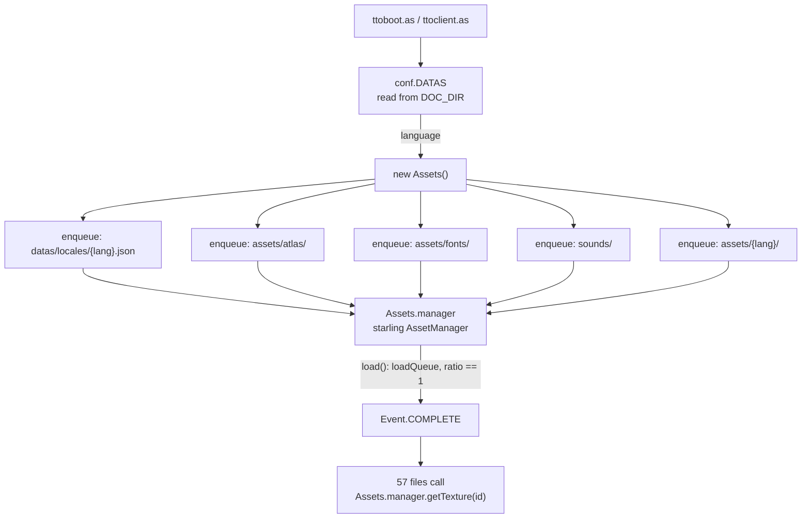
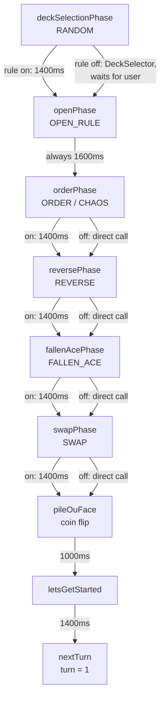
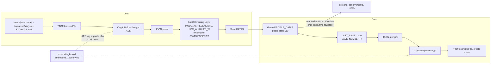

# Data Flow: Critical Components

Phase 0, Task 1.3 deliverable — the last one.

**What this is.** Runtime flow for the five paths that carry state in the AS3 client, as read
from source. [dependency-matrix.md](./dependency-matrix.md) covers *static* structure — who
imports whom. This covers what happens at run time: who mutates what, in what order, and who
waits for whom.

**Why it matters.** The static graph makes the port look like a translation exercise. The
runtime graph shows it is not. Three findings below determine how much of the codebase can be
ported versus rewritten, and they are all invisible in an import list.

---

## 1. The three findings that matter

### 1.1 There is no model layer

Domain state lives inside display objects. The clearest case is `Card.modifier`, which has no
backing field at all — the setter writes into a Starling `TextField` and the getter parses the
string back out (`Card.as:102-115`):

```actionscript
public function set modifier(value:int):void { _modifier.text = ...; }
public function get modifier():int { return int(_modifier.text); }
```

`Tile` holds the effective powers (`Tile.as`), `playerPanel` holds the hand and computes the
score (`playerPanel.as:239-245`), and `Board` holds the tiles (`Board.as`). Every one of those
is a Starling display object. **There is no class that represents a match, a board or a hand
independently of the screen rendering it.**

Consequence: the rules engine cannot be unit-tested in the original, and `TTOCore.applyRules`
cannot evaluate a candidate move without mutating the board (see § 4.3). In the port, the
domain model must be extracted first and the UI must read from it — not the other way round.
That is a rewrite of these paths, not a translation.

### 1.2 Control flow is a `setTimeout` chain, not a state machine

`setTimeout` appears **57 times across `tto/`**, twelve of them in the two files that sequence a
single match (`BaseMatchScreen.as` 10, `TTOCore.as` 2). The pre-match rule
presentation is a seven-link cascade (§ 3), the capture animation schedules combo waves at
`(j+3)*400` ms (`TTOCore.as:152`), and the turn advance is itself deferred
(`TTOCore.as:171`, `BaseMatchScreen.as:358`).

Nothing observes completion. Each link guesses how long the previous animation takes and
schedules the next accordingly — `1400`, `1600`, `1200`, `600` ms constants chosen to be longer
than the animation they follow. `justAsec` (`TTOCore.as:95`, `:154`) accumulates a delay budget
as combo waves are queued, so the turn advance waits for however long the flips were *estimated*
to need.

This is the single largest structural change in the migration. In Kotlin these become
`suspend` functions where each step awaits the previous, plus an explicit match state machine.
That removes the timing constants entirely — and it is also the reason animation timing cannot
be "ported": there is nothing to port, only durations to re-derive.

### 1.3 Global mutable statics couple the rules exit path to the save file

`Game.PROFILE_DATAS` is a `public static var Object` (`Game.as:26`) referenced **397 times across
35 files** — including directly inside `endGame()` (`PVEMatchScreen.as:57-75` and beyond), which
awards MGP and XP, bumps statistics and evaluates achievements. Alongside it:
`Game.LOGGED_IN`, `Game.MATCHES`, `Game.USERS`, `Assets.manager`, `conf.DATAS`, `Save.DATAS`.

So ending a match writes the save data structure. In the port, `endGame` should return a result
and let something else decide what to persist.

---

## 2. Boot and asset loading

The highest fan-in class in the codebase is `utils/Assets.as` — 57 files depend on it
([dependency-matrix.md](./dependency-matrix.md)) — and it is 34 lines long. All it does is
enqueue five sources into a Starling `AssetManager` and load them.



Reading, all from `Assets.as:15-32`:

- **Everything is loaded eagerly at boot**, from `TTOFiles.APP_DIR`. There is no lazy or
  per-screen loading, and no unloading.
- **Locale is baked into the asset paths.** `assets/{lang}/` and the locale JSON are enqueued
  by language, so changing language means re-running the whole load.
- **Completion is signalled by a ratio comparison**, `if (ratio == 1)`. Any partial failure
  leaves the callback silent — there is no error path.
- **`Assets.manager` is a mutable public static**, and consumers call
  `getTexture(id)` with string ids resolved at run time. A missing texture is a runtime
  surprise, not a compile error. This is what the Compose resources migration has to replace,
  and it is why `Res`-generated accessors are a genuine improvement rather than a lateral move.

**The assets are not in the shipped APK.** `sources/air/tto.apk` (9.67 MB) contains no card
artwork — it is a downloader shell that fetches into the app directory at first run
([performance-baseline.md](./performance-baseline.md) §1). The decision for the port is the
opposite: assets ship inside the APK
([04-PHASE-0-PREPARATION.md § Decisions taken](../migration/04-PHASE-0-PREPARATION.md#-decisions-taken-2026-07-25)).
So the download path disappears entirely and the eager-load-everything shape becomes a real
constraint rather than an implementation detail — roughly 45 MB of resources, resident.

---

## 3. Pre-match rule presentation

Seven links, each either scheduling the next with a delay or calling it directly when its rule
is off (`BaseMatchScreen.as:113-254`). This is the clearest example of § 1.2.



Notes that matter for the port:

- **Only two links do real work.** `RANDOM` builds a hand (`:124-135`) and `SWAP` exchanges a
  card per side (`:224-229`). `openPhase` sets a visibility flag. The other three —
  `orderPhase`, `reversePhase`, `fallenAcePhase` — **exist purely to play an animation**; the
  rules themselves are applied later, at turn start or inside `TTOCore`. Porting them as
  "phases" would reproduce scaffolding rather than behaviour.
- **`openPhase` always reveals the local player's own hand** (`:172` and `:176` both set
  `bluePlayer.openRule = RULE_ALL_OPEN`). Open is only ever about the opponent.
- The chain is **not cancellable**. Leaving the screen mid-cascade leaves timers scheduled
  against a detached screen.

---

## 4. The turn loop

The critical path. One placement travels from a touch to a resolved board, and the loop
re-enters until the board is full.

```mermaid
flowchart TD
    touch["cardTouched / drag-drop<br/>or AI / timeout autoPlay"] --> place["tile.card = card"]
    place --> apply["TTOCore.applyRules(tile, timeline[turn])"]

    apply --> p1["1. tile.color = color"]
    p1 --> p2["2. copy card powers to tile<br/>FALLEN_ACE zeroes any 10"]
    p2 --> p3["3. ASCENSION / DESCENSION<br/>tile.pow += card.modifier, clamp 0..10"]
    p3 --> p4["4. ELEMENTAL<br/>modifier from tile.element, then clamp"]
    p4 --> branch{"checking?"}

    branch -->|"true: AI dry run"| count["count distinct flipped tiles<br/>return power, NO animation"]
    branch -->|"false"| anim["animate(tile, color)"]

    anim --> sel{"SAME or SAME_WALL or PLUS?"}
    sel -->|"yes"| special["specialRule<br/>basic compare tagged 'ZZ'<br/>+ SAME / PLUS / SAME_WALL<br/>+ comboRule per capture"]
    sel -->|"no"| basic["basicRule<br/>power compare only"]

    special --> dedup["sortOn type, dedup by tile.id<br/>PLUS before SAME before ZZ"]
    dedup --> flips["card.flipTo(...)<br/>combo waves at (j+3)*400ms"]
    basic --> flips2["card.flip(...)"]

    flips --> asc["setTimeout ascensionPhase, justAsec"]
    flips2 --> asc
    asc --> tally["ASCENSION/DESCENSION:<br/>ascensionByType[type] += or -= 1<br/>then applyAscension on BOTH hands"]
    tally --> next["nextTurn"]
    next --> score["updateScores<br/>count colours across both hands"]
    score --> t{"++turn == 10?"}
    t -->|"yes"| end["endGame"]
    t -->|"no"| touch
```

### 4.1 What flows where

| Data | Owner | Mutated by |
|---|---|---|
| `tile.color`, `tile.{top,right,bottom,left}Pow` | `Tile` (display object) | `TTOCore.applyRules:25-56`, `playerPanel.applyAscension:166-175`, `Card.set tile:359-368` |
| `card.modifier` | `Card` — **stored in a TextField** | `TTOCore.applyRules:48-50` (Elemental), `playerPanel.applyAscension:158`, `PVEMatchScreen.as:212` (reset) |
| `card.color` | `Card` | `flip` / `flipTo` during animation |
| `ascensionByType` | `BaseMatchScreen` | `ascensionPhase:339, :346` |
| `turn`, `timeline` | `BaseMatchScreen` | `nextTurn:368`, `pileOuFace:242` |
| scores | derived, not stored | recomputed every `nextTurn` from card colours |

**Three independent paths write tile powers.** `applyAscension` recomputes from raw card values
and is therefore idempotent, which probably masks the overlap — but whether `Card.set tile` can
double-apply a modifier depends on call ordering I did not trace
([game-rules.md § 15.8](./game-rules.md#158-modifier-application-has-three-independent-paths--hazard-not-confirmed)).
In the port, compute effective power in exactly one pure function and the question cannot arise.

### 4.2 Scores are derived, never stored

`updateScores` (`BaseMatchScreen.as:315-321`) sums `getScores()` over both panels, and
`getScores` (`playerPanel.as:239-245`) counts card colours across that panel's five cards —
whether played or still in hand. So the score is a pure function of card ownership, the total is
always 10, and an unplayed card counts for its owner. Nothing caches it. **This part ports
cleanly** and is the model for how the rest should look.

### 4.3 The AI dry run is not side-effect free

`applyRules(tile, color, checking = true)` reaches its `checking` branch **after** steps 1-4
have already mutated `tile.color`, the tile powers and — under Elemental — `card.modifier`.
`PVEMatchScreen.as:212` exists to patch one instance of the resulting damage:

```actionscript
if (RULES.TYPE_RULE == tripleTriadRules.RULE_ELEMENTAL) tile.card.modifier = 0;
```

This is § 1.1 made concrete: because the board is display objects, evaluating a hypothetical
move means mutating the real one. A pure
`evaluate(board, rules, candidate): Set<TileId>` removes the patch and makes the AI testable.

---

## 5. Profile persistence



Read from `Save.as:20-96`, `CryptoHelper.as:8-18`, `TTOFiles.as:45-81`.

**The AES key is the pixel data of an embedded GIF.** `CryptoHelper.as:8` embeds
`assets/tto_key.gif` and derives the key from `getPixels(new Rectangle(0,0,31,31))`. The file is
committed to this repository. So the save encryption is **obfuscation, not security** — which is
a reasonable design for a single-player save file, but should be called what it is.

For the port this is a decision, not a port: the encryption exists to deter save editing, there
is no multiplayer economy to protect, and the entire vendored `as3crypto` library is pulled in by
**exactly two imports in project code** — `AESKey` and `Hex`, both in `CryptoHelper.as:2-3`.
Dropping the save encryption removes a third-party dependency outright, and the key-management
question with it. If tamper-resistance is wanted later, it should use a real key store rather
than an image.

Other readings worth carrying forward:

- **The save filename embeds the creation timestamp**:
  `saves/{username} - {creationDate}.sav` (`Save.as:85`). But `load(profile_name)` looks up
  `saves/{profile_name}.sav` (`:51`), so the caller must reconstruct
  `"username - timestamp"` exactly. Fragile by construction; a stable id belongs in the file
  contents, not the name.
- **`save()` is duplicated** as an instance method and a static one with identical bodies
  (`Save.as:81-95`).
- **Load backfills schema drift by hand** — four `if (!DATAS.x)` guards plus a recomputed
  `FORFEITS`. That is a migration system implemented as four `if`s. The port should version the
  save format explicitly; `kotlinx.serialization` with defaults covers most of it.
- **There is no write on a schedule and no atomic write.** `writeFile` with `create = true`
  truncates in place, so a crash mid-write loses the profile. A temp-file-plus-rename would fix
  it, and `TTOFiles.renameFile` already exists (`:39`).

---

## 6. What ports, what gets rewritten

Directly derived from the flows above. This is the practical output of the document.

| Path | Verdict | Why |
|---|---|---|
| Score computation (§ 4.2) | **ports directly** | Already a pure function of card ownership |
| Capture resolution — basic, Same, Plus, Same Wall (§ 4) | **ports as logic, rewritten as structure** | Rules are clear and specified in [game-rules.md](./game-rules.md); the AS3 form mutates display objects |
| Combo wave grouping (§ 4) | **rewrite** | Shared mutable `enqueue`, author's own `// TODO : correct combo` |
| Pre-match rule chain (§ 3) | **rewrite** | Five of seven links are animation scaffolding |
| Turn sequencing (§ 1.2) | **rewrite** | Timing constants replace completion signals; needs a state machine |
| AI evaluation (§ 4.3) | **rewrite** | Not side-effect free by construction |
| Asset loading (§ 2) | **replace** | Starling `AssetManager` → Compose resources; unvalidated, and the highest-risk item in Phase 1 |
| Profile persistence (§ 5) | **ports as data, replace the mechanism** | Keep the shape, drop the GIF-key encryption, version the format |
| `Game.PROFILE_DATAS` globals (§ 1.3) | **rewrite** | Global mutable statics written from `endGame` |

**Suggested order**, which falls out of the dependencies rather than from preference: extract the
domain model (board, tile, card, hand, rules) → port capture resolution against the
[35-case test matrix](./game-rules.md#16-test-matrix-for-the-port) with no UI → build the match
state machine → then the UI. Asset loading is independent and can be spiked in parallel; it is
the item most likely to invalidate a plan.

---

## 7. What this document does not cover

- **Screen navigation.** 31 navigation transitions are unchecked strings
  ([event-catalog.md](./event-catalog.md)); the routing graph is not diagrammed here.
- **The network path**, which is 3 outbound actions and 2 inbound messages and is being
  abandoned — [network-protocol.md](./network-protocol.md),
  [09-PHASE-5-NETWORK.md](../migration/09-PHASE-5-NETWORK.md).
- **Achievements and reward calculation.** `endGame` in each match screen is long and
  profile-coupled; only the coupling is recorded (§ 1.3), not the formulas.
- **Sound.** `SoundManager` is called from the flows above and not traced.
- **Execution verification.** As with [game-rules.md](./game-rules.md), the AIR client is
  abandoned and nothing here was confirmed by running it. Every claim is a reading of source,
  and the one ordering question I could not resolve statically is marked as a hazard rather than
  asserted (§ 4.1).

---

## 8. Related

- [game-rules.md](./game-rules.md) — what the rules engine computes, rule by rule
- [dependency-matrix.md](./dependency-matrix.md) — static structure and migration order
- [event-catalog.md](./event-catalog.md) — every event dispatched or listened for
- [architecture-guidelines.md](../development/architecture-guidelines.md) — the target shape
- [07-PHASE-3-CORE-LOGIC.md](../migration/07-PHASE-3-CORE-LOGIC.md) — the phase that consumes
  this
